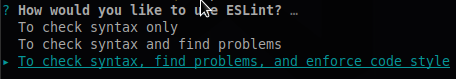
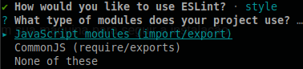
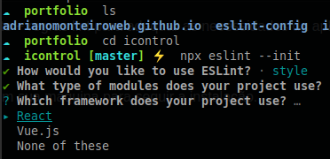
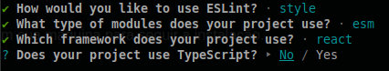
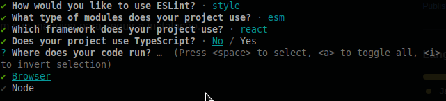
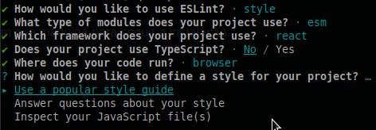
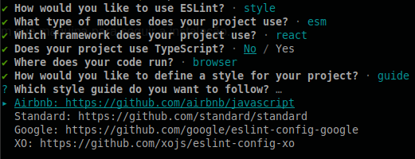
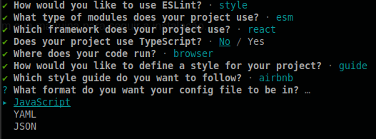
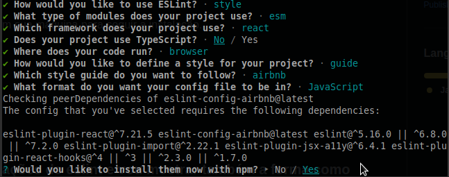
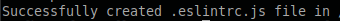

# ESLint-config: Como configurar eslint em um projeto + regras lint para adequar as necessidades da aplicação.

*Antes de começar*
- [ ] Garanta que seu NPM está ok em sua máquina para seguir a instalação.

*Instalação*
- [ ] Use o comando abaixo para instalar o ESLint.
```
 npm install eslint --save-dev
```

*Configurando*
- [ ] Use o comando abaixo para iniciar a configuração de seu ESLint.
```
 npx eslint --init
```

### Aqui começam as configurações do eslint e vou mostrar também a forma como costumo configurar:
*How would you like to use ESLint? / Como você gostaria de usar o ESLint?*



- [ ] To check syntax only / Verificar apenas a sintaxe.
- [ ] To check syntax and find problems / Verificar a sintaxe e encontrar problemas.
- [x] To check syntax, find problems and enforce code style / Verificar a sintaxe, encontrar problemas e aplicar o estilo do código.

*What type of modules does your project use? / Que tipo de módulos seu projeto usa?*



- [x] JavaScript modules (import/export).
- [ ] JCommonJS (require/exports).

*Which framework does your project use? / Qual framework seu projeto usa?*



- [x] React.
- [ ] Vue.js.
- [ ] None of these / Nenhum desses.

*Does your project use TypeScript? / Seu projeto usa TypeScript?*



- [x] No.
- [ ] Yes.

*Where does your code run? / Onde seu código é executado?*



- [x] Browser.
- [ ] Node.

*How would you like to define a style for your project? / Como você gostaria de definir um estilo para seu projeto?*



- [x] Use a popular style guide / Use um guia de estilo popular.
- [ ] Answer questions about your style / Responda perguntas sobre o seu estilo.
- [ ] Inspect your JavaScript file(s) / Inspecione seus arquivos JavaScript.

### OBS: Caso as opções de estilo do ESLint a seguir não apareça, prossiga com a instalação até o fim e reinicie a configuração com o comando: "npx eslint --init".

*Which style guide do you want to follow? / Qual guia de estilo você deseja seguir?*



- [x] Airbnb: https://github.com/airbnb/javascript
- [ ] Standard: https://github.com/standard/standard
- [ ] Google: https://github.com/google/eslint-config-google
- [ ] XO: https://github.com/xojs/eslint-config-xo

*What format do you want your config file to be in? / Em que formato você deseja que seu arquivo de configuração esteja?*



- [x] JavaScript.
- [ ] YAML.
- [ ] JSON.

*Would you like to install them now with npm? / Gostaria de instalar agora com o npm?*



- [ ] No.
- [x] Yes.

*Ao exibir a mensagem a seguir, seu ESLint foi configurado corretamente!*



#### No arquivo oculto chamado ".eslintrc.js" que se encontra neste repositório, você encontrará não apenas o arquivo gerado por essa configuração, mas também as rules: {}. Regras para um ESLint que irá melhorar seu código e que você pode alterar como quiser. Aconselho que copie todo o seu conteúdo e substitua pelo gerado na configuração.

#### OBS: Essas regras foram implementadas para o estylo ESLint Airbnb!

*Basta ao terminar suas configurações subistituir todo o arquivo, ou apenas as rules: {}*


<div>
  <h2>Dica de extensão no VScode:</h2>
  <p><i>Você pode utilizar junto a essa configuração as extensões <span>ESLint</span> e/ou <span>Error Lens</span>. Sim, é possível usar as duas sem conflitos, porém, para alguns projetos a extensão Premire pode conflitar com a ESLint. Atenção para esse detalhe.</i></p>
  <a href="https://marketplace.visualstudio.com/items?itemName=dbaeumer.vscode-eslint" target="_blank">ESLint</a>
  <a href="https://marketplace.visualstudio.com/items?itemName=usernamehw.errorlens" target="_blank">Error Lens</a>
</div>